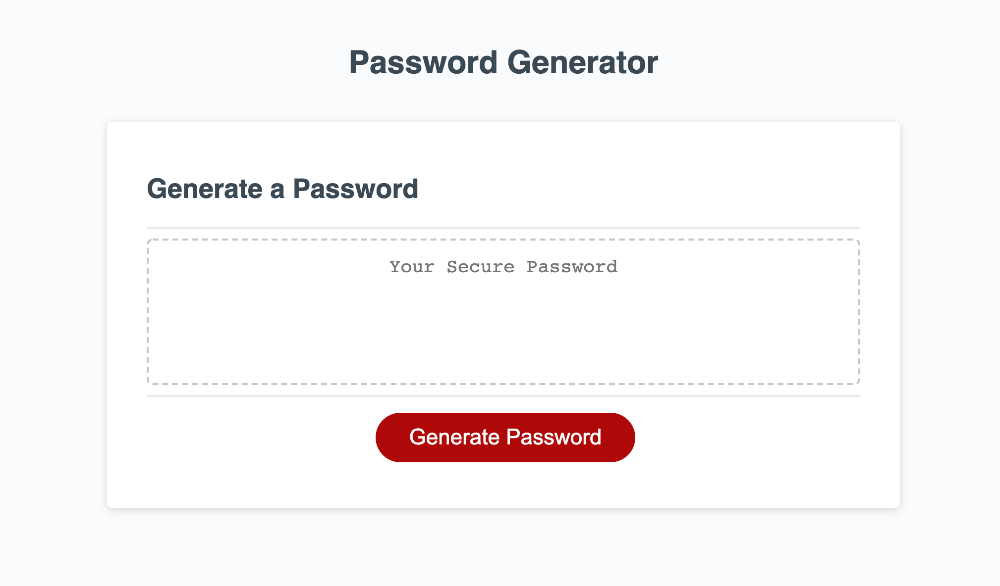

# Password Generator

## Description

* A password generator created with dynamic HTML and CSS powered by Javascript. When the user generates a password he is presented with serveral prompts for the password criteria. The password varies from (8-128) characters and it can include lowercase, uppercase, numbers and special characters. 

## Screenshot 

## Website 

https://kevin-hernandez-garza.github.io/passwordGenerator/